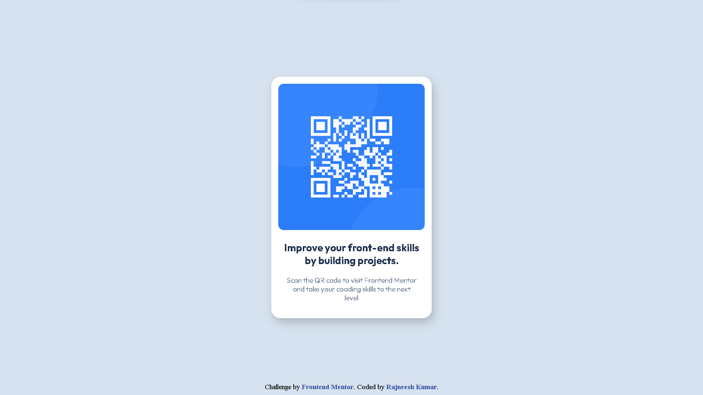
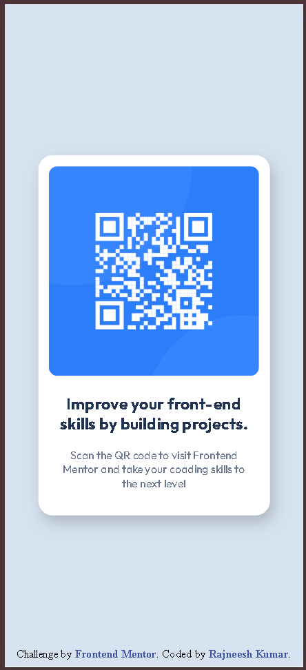

# Frontend Mentor - QR code component solution

This is a solution to the [QR code component challenge on Frontend Mentor](https://www.frontendmentor.io/challenges/qr-code-component-iux_sIO_H). Frontend Mentor challenges help you improve your coding skills by building realistic projects.

## Overview

### Screenshot




### Links

- **Solution URL :** [QR Code Component Solution](https://github.com/therajneeshkumar/QR-code-component#)
- **Live Site URL :** [QR Code Component](https://therajneeshkumar.github.io/QR-code-component/)

## My process

### Built with

- Semantic HTML5 markup
- CSS custom properties
- Flexbox
- Mobile-first workflow
- Google Fonts (outfit)

### What I learned

While building this project, I improved my understanding of:

- Structuring clean semantic HTML
- Centering elements using Flexbox
- Working with HSL color values
- Matching a design layout closely
- Importing and using Google Fonts

Used a container with class **image** for img tag inside a card container.

```html
<div class="image">
  
</div>
```

One thing I focused on was vertically and horizontally centering the card using Flexbox:

```css
.container {
  min-height: 100vh;
  display: flex;
  justify-content: center;
  align-items: center;
}
```

### Continued development

In future projects, I want to:

- Improve my spacing accuracy when matching designs
- Practice building more responsive layouts
- Learn more about accessibility best practices
- Eplore more advanced CSS techniques

### AI Collaboration

I used one AI Tool during this project. This helps me to understand the project overview.

- **Tool :** ***ChatGPT***
- **Use :** To understand the markdown files of project and what to do for this project.
- The work of this tool is to explain the markdown files in simple way.

## Author

- **GitHub** - [Rajneesh Kumar](https://github.com/therajneeshkumar)

## Acknowledgments

Thanks to the **Frontend Mentor** community for providing helpful resources and feedback.
